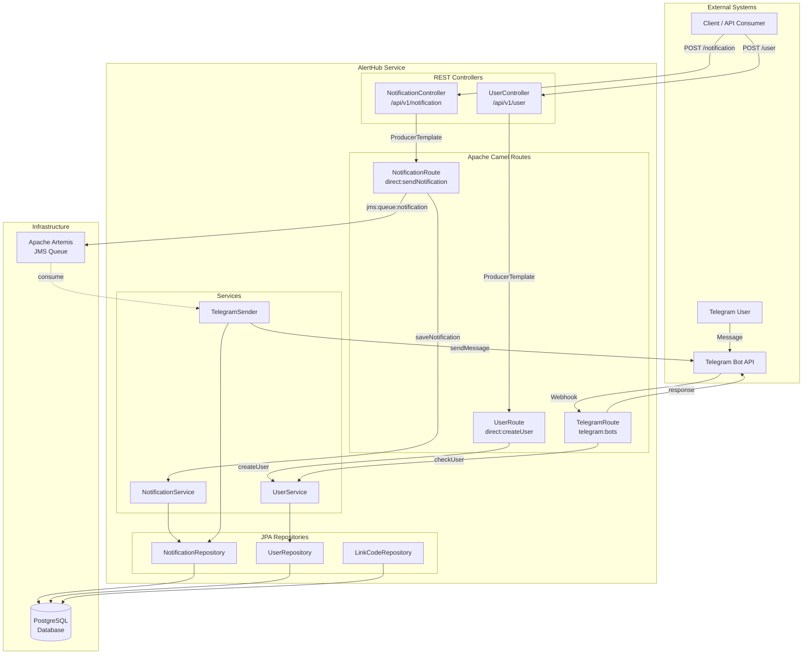

# AlertHub - Architecture Diagram

```mermaid
flowchart TB
    subgraph External["External Systems"]
        Client["Client / API Consumer"]
        TelegramUser["Telegram User"]
        TelegramAPI["Telegram Bot API"]
    end

    subgraph AlertHub["AlertHub Service"]
        subgraph Controllers["REST Controllers"]
            NC["NotificationController<br/>/api/v1/notification"]
            UC["UserController<br/>/api/v1/user"]
        end

        subgraph CamelRoutes["Apache Camel Routes"]
            NR["NotificationRoute<br/>direct:sendNotification"]
            UR["UserRoute<br/>direct:createUser"]
            TR["TelegramRoute<br/>telegram:bots"]
        end

        subgraph Services["Services"]
            NS["NotificationService"]
            US["UserService"]
            TS["TelegramSender"]
        end

        subgraph Repositories["JPA Repositories"]
            NRepo["NotificationRepository"]
            URepo["UserRepository"]
            LCRepo["LinkCodeRepository"]
        end
    end

    subgraph Infrastructure["Infrastructure"]
        PostgreSQL[("PostgreSQL<br/>Database")]
        Artemis["Apache Artemis<br/>JMS Queue"]
    end

    %% External to Controllers
    Client -->|"POST /notification"| NC
    Client -->|"POST /user"| UC
    TelegramUser -->|"Message"| TelegramAPI

    %% Controllers to Routes
    NC -->|"ProducerTemplate"| NR
    UC -->|"ProducerTemplate"| UR

    %% Telegram to Route
    TelegramAPI -->|"Webhook"| TR

    %% Routes to Services
    NR -->|"saveNotification"| NS
    UR -->|"createUser"| US
    TR -->|"checkUser"| US

    %% Routes to Queue
    NR -->|"jms:queue:notification"| Artemis

    %% Queue to Sender
    Artemis -.->|"consume"| TS

    %% Sender to Telegram
    TS -->|"sendMessage"| TelegramAPI

    %% Services to Repositories
    NS --> NRepo
    US --> URepo
    TS --> NRepo

    %% Repositories to DB
    NRepo --> PostgreSQL
    URepo --> PostgreSQL
    LCRepo --> PostgreSQL

    %% Telegram response
    TR -->|"response"| TelegramAPI
```
