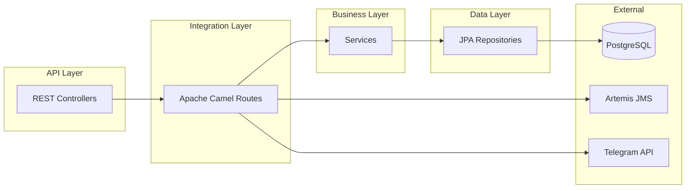

# AlertHub - Component Diagram

```mermaid
graph LR
    subgraph "API Layer"
        A[REST Controllers]
    end

    subgraph "Integration Layer"
        B[Apache Camel Routes]
    end

    subgraph "Business Layer"
        C[Services]
    end

    subgraph "Data Layer"
        D[JPA Repositories]
    end

    subgraph "External"
        E[(PostgreSQL)]
        F[Artemis JMS]
        G[Telegram API]
    end

    A --> B
    B --> C
    B --> F
    C --> D
    D --> E
    B --> G
```
