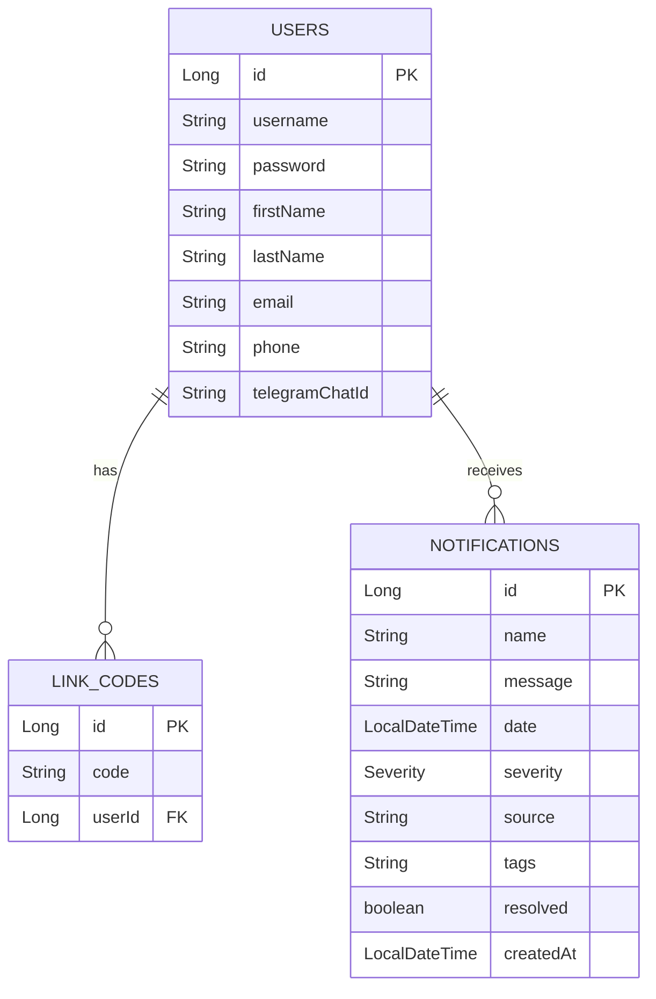

# AlertHub - Entity Relationship Diagram

```mermaid
erDiagram
    USERS {
        Long id PK
        String username
        String password
        String firstName
        String lastName
        String email
        String phone
        String telegramChatId
    }

    NOTIFICATIONS {
        Long id PK
        String name
        String message
        LocalDateTime date
        Severity severity
        String source
        String tags
        boolean resolved
        LocalDateTime createdAt
    }

    LINK_CODES {
        Long id PK
        String code
        Long userId FK
    }

    USERS ||--o{ LINK_CODES : "has"
    USERS ||--o{ NOTIFICATIONS : "receives"
```
