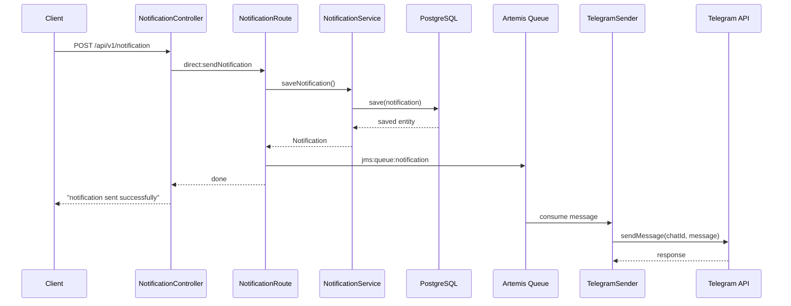

# AlertHub - Sequence Diagram (Send Notification)

```mermaid
sequenceDiagram
    participant C as Client
    participant NC as NotificationController
    participant NR as NotificationRoute
    participant NS as NotificationService
    participant DB as PostgreSQL
    participant JMS as Artemis Queue
    participant TS as TelegramSender
    participant T as Telegram API

    C->>NC: POST /api/v1/notification
    NC->>NR: direct:sendNotification
    NR->>NS: saveNotification()
    NS->>DB: save(notification)
    DB-->>NS: saved entity
    NS-->>NR: Notification
    NR->>JMS: jms:queue:notification
    NR-->>NC: done
    NC-->>C: "notification sent successfully"

    JMS->>TS: consume message
    TS->>T: sendMessage(chatId, message)
    T-->>TS: response
```
